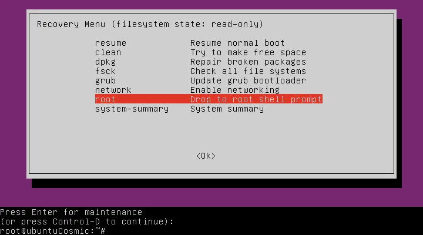
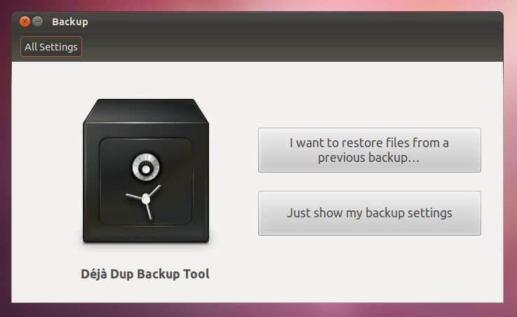

<!-- SLIDE 1 -->
# **RA03 – Bloc 5**
## **Recuperació del sistema i còpies de seguretat**

**SMX01 - Sistemes Operatius Monolloc**  
**Professor - Hèctor Pascual**

---

<!-- SLIDE 2 -->
# 🔸 **Què treballarem en aquest bloc**

Aquest bloc se centra en:

- Recuperació del sistema a **Windows**  
- Còpies de seguretat a **Windows**  
- Verificació i documentació de l'administració del sistema  
- Recuperació del sistema a **Ubuntu**  
- Còpies de seguretat a **Ubuntu**  

Objectiu: conèixer eines per mantenir el sistema estable i poder recuperar dades o configuracions quan hi ha problemes   

---

<!-- SLIDE 3 -->
# 🔸 **Per què cal recuperar el sistema**

Els sistemes operatius poden perdre rendiment amb el temps per diverses raons:

- Instal·lació i desinstal·lació d'aplicacions i controladors  
- Errors en actualitzacions  
- Execució de programes maliciosos  

Quan es detecten errors o rendiment deficient, es poden aplicar mètodes de **recuperació del sistema** per mantenir l'equip en condicions òptimes   

---

<!-- SLIDE 4 -->
# 🔸 **Punts de restauració a Windows**

Els **punts de restauració** són:

- còpies automàtiques del sistema operatiu en certs moments  
- recuperació del sistema en cas de problemes  
- mecanisme que no afecta els arxius personals  

Es creen automàticament quan hi ha canvis importants:

- instal·lació de programes  
- controladors  
- actualitzacions  

També es poden crear manualment com a mesura preventiva.

---

<!-- SLIDE 5 -->
# 🔸 **Com gestionar els punts de restauració**

**Crear un punt de restauració:**

`Tauler de control → Sistema i seguretat → Sistema → Protecció del sistema → Crear`

**Restaurar el sistema:**

`Tauler de control → Sistema i seguretat → Sistema → Protecció del sistema → Restaurar sistema`

Idea important:

- durant la restauració es poden eliminar programes afectats  
- els arxius personals no es veuen afectats  

---

<!-- SLIDE 6 -->
# 🔸 **Activació de la protecció del sistema**

Si no apareix cap punt de restauració, la protecció del sistema pot estar desactivada.

**Com comprovar-ho i activar-la:**

`Tauler de control → Recuperació → Configurar restaurar sistema → Configurar`

Després cal seleccionar:

- **Activar protecció del sistema**

Sense aquesta opció activada, no es poden utilitzar punts de restauració.

---

<!-- SLIDE 7 -->
# 🔸 **Inici en mode segur**

El **mode segur** inicia el sistema en un estat bàsic amb només:

- els arxius essencials  
- els controladors essencials  

S'utilitza per:

- diagnosticar i solucionar problemes  
- desinstal·lar aplicacions o controladors que causen errors  
- eliminar virus o programes maliciosos que impedeixen l'inici normal  

---

<!-- SLIDE 8 -->
# 🔸 **Com accedir al mode segur a Windows 10**

1. `Configuració → Actualització i seguretat → Recuperació`  
2. `Inici avançat → Reiniciar ara`  
3. `Solucionar problemes → Opcions avançades → Configuració d'inici → Reiniciar`  
4. Un cop reiniciat, seleccionar:
   - **Habilitar mode segur**
   - **Habilitar mode segur amb funcions de xarxa**

---

<!-- SLIDE 9 -->
# 🔸 **Mode segur amb funcions de xarxa**

**Mode segur:**

- inicia el sistema amb només els arxius i controladors essencials  

**Mode segur amb funcions de xarxa:**

- afegeix serveis i controladors necessaris per a la connexió a internet i a altres equips de la xarxa  

Per sortir del mode segur:

- cal reiniciar l'equip  

---

<!-- SLIDE 10 -->
# 🔸 **Accés alternatiu al mode segur**

Si no es pot accedir des de **Configuració → Recuperació**, hi ha altres mètodes:

**Des de la pantalla d'inici de sessió:**

- prémer **Majúscula (Shift)** mentre es fa clic a **Inici → Reiniciar**  
- després: `Solucionar problemes → Opcions avançades → Configuració d'inici → Reiniciar`

**Si el sistema no arrenca:**

- apagar i encendre l'equip repetidament  
- mantenir premut el botó d'engegada durant 10 segons per forçar l'entrada a l'entorn de recuperació de Windows  

---

<!-- SLIDE 11 -->
# 🔸 **Què és una còpia de seguretat**

Una **còpia de seguretat** és:

- una còpia de les dades del sistema  
- emmagatzemada en un dispositiu extern  
- útil per restaurar informació en cas de pèrdua o corrupció  

Per què és important?

- evita la pèrdua de dades per errors del sistema o del disc dur  
- permet recuperar informació en cas de fallada  
- es recomana fer còpies periòdiques  

---

<!-- SLIDE 12 -->
# 🔸 **Tipus de còpies de seguretat**

- **Còpia completa** → guarda totes les dades seleccionades  
- **Còpia incremental** → guarda només els canvis des de l'última còpia  
- **Còpia diferencial** → guarda només els canvis des de l'última còpia completa  
- **Còpia mirall** → igual que la completa, però sense compressió  

Notes:

- la còpia completa és la que Windows 10 fa per defecte  
- la incremental és més ràpida i ocupa menys espai  
- la diferencial és més fiable que la incremental, però més pesada  

---

<!-- SLIDE 13 -->
# 🔸 **Bones pràctiques en còpies de seguretat**

- **No desar la còpia al mateix disc**  
  si el disc falla, es pot perdre tant el sistema com la còpia  

- **Ubicació segura**  
  desar les còpies en un dispositiu extern o al núvol  

- **Xifrar les dades**  
  millora la seguretat en cas de pèrdua o robatori del dispositiu  

A Windows 10 es pot utilitzar l'**Historial d'arxius**:

`Inici → Configuració → Actualització i seguretat → Còpia de seguretat`

---

<!-- SLIDE 14 -->
# 🔸 **Configuració i restauració a Windows 10**

**Configuració de la còpia de seguretat:**

1. `Afegir una unitat` i seleccionar un dispositiu o xarxa  
2. Activar **Realitzar una còpia de seguretat automàtica dels meus arxius**  
3. A **Més opcions**, configurar:
   - quins arxius incloure  
   - freqüència de les còpies  
   - carpetes que s'han d'excloure  

**Restauració d'arxius:**

1. `Tauler de control → Historial d'arxius`  
2. Seleccionar l'arxiu i navegar per versions anteriors  
3. Clicar **Restaurar**  

---

<!-- SLIDE 15 -->
# 🔸 **Còpies de seguretat en línia**

Les còpies en línia utilitzen **servidors en línia** i són una alternativa als dispositius físics.

Beneficis principals:

- **Fàcil accés**  
- **Multiplataforma**  
- **Automatització**  
- **Escalabilitat**  
- **Redundància**  

Exemples:

- EaseUS Todo Backup  
- Paragon Backup & Recovery  
- Veeam Backup  
- Google Drive, OneDrive i Dropbox  

---

<!-- SLIDE 16 -->
# 🔸 **Altres mètodes de recuperació a Windows**

Windows 10 permet reinstal·lar el sistema amb dues opcions:

- **Mantenir els arxius personals**  
  reinstal·la el sistema conservant els arxius personals  

- **Treure-ho tot**  
  elimina arxius personals, aplicacions i configuracions  

Aquesta segona opció és recomanada si es vol vendre o cedir l'equip.

---

<!-- SLIDE 17 -->
# 🔸 **Com restablir l'equip i tornar enrere**

**Restablir aquest PC:**

- `Configuració → Actualització i seguretat → Recuperació → Restablir aquest PC`  
- o bé: `Recuperació → Inici avançat → Reiniciar ara → Solucionar problemes → Restablir aquest equip`  

**Tornar a una versió anterior de Windows:**

- útil si els problemes han aparegut després d'una actualització  
- es fa des de `Configuració → Actualització i seguretat → Recuperació`  
- els arxius personals es mantenen, però s'eliminen aplicacions i controladors instal·lats després de l'actualització  

---

<!-- SLIDE 18 -->
# 🔸 **Verificació i documentació del sistema**

Documentar el procés és important perquè:

- assegura el correcte funcionament del sistema  
- facilita la gestió i resolució de problemes  
- permet als responsables seguir els passos adequats  

Informació que cal documentar:

- dades del maquinari  
- usuaris i grups  
- recursos compartits  
- còpies de seguretat  
- manteniment de l'equip  
- incidències del sistema  

---

<!-- SLIDE 19 -->
# 🔸 **Avantatges de la documentació**

- fa que tothom sàpiga què s'ha fet encara que no hi fos present  
- facilita la formació i l'aprenentatge del personal  
- automatitza tasques i millora la productivitat  
- millora la planificació i optimitza els recursos  

---

<!-- SLIDE 20 -->
# 🔸 **Recuperació del sistema a Ubuntu**

A Ubuntu, la recuperació i actualització del sistema és important perquè:

- manté el sistema estable i segur  
- corregeix errors i vulnerabilitats  
- millora el rendiment i la compatibilitat del maquinari  

Mètodes principals:

- **Recuperació del sistema**  
- **Actualització del sistema**  

---

<!-- SLIDE 21 -->
# 🔸 **Mode de recuperació d'Ubuntu**

En el menú de recuperació d'Ubuntu apareixen eines com:
`GRUB → Advanced options → recovery mode`

- `resume` → continua l'arrencada normal  
- `clean` → allibera espai eliminant paquets innecessaris  
- `dpkg` → repara paquets problemàtics  
- `fsck` → comprova i repara el sistema de fitxers  
- `grub` → actualitza el carregador d'arrencada  
- `network` → activa la xarxa  
- `root` → accedeix al terminal com a superusuari  
- `system-summary` → mostra un resum del sistema  

---

<!-- SLIDE 21 -->
# 🔸 **Mode de recuperació d'Ubuntu**



---

<!-- SLIDE 22 -->
# 🔸 **Còpies de seguretat a Ubuntu**

Per què són importants?

- eviten la pèrdua de dades per errors del sistema o eliminació accidental  
- permeten restaurar informació en cas de fallada  

**Déjà Dup**  :

- aplicació integrada per defecte a Ubuntu  
- permet còpies manuals i automàtiques  
- facilita la restauració de dades d'usuari  

---

<!-- SLIDE 21 -->
# 🔸 **Mode de recuperació d'Ubuntu**



---

<!-- SLIDE 23 -->
# 🔸 **Configuració de còpies de seguretat a Ubuntu**

Ubuntu inclou eines gràfiques i ordres de terminal per gestionar còpies de seguretat

A **Déjà Dup**, les opcions principals són:

- **Resum** → crear i restaurar còpies  
- **Carpetes que cal desar** → seleccionar directoris  
- **Carpetes que cal ignorar** → excloure directoris  
- **Ubicació d'emmagatzematge** → discs externs, servidors o núvol  

S'hi pot accedir cercant **Còpies de seguretat** a la barra superior.

---

<!-- SLIDE 24 -->
# 🔸 **Crear i restaurar amb Déjà Dup**

**Per fer una còpia manualment:**

1. Anar a **Resum**  
2. Seleccionar **Fes la còpia de seguretat ara**  
3. Seguir la barra de progrés fins al final  

**Per restaurar una còpia:**

1. Anar a **Resum**  
2. Clicar **Restaura**  
3. Seleccionar la ubicació i la versió  
4. Confirmar la restauració  

---

<!-- SLIDE 25 -->
# 🔸 **Eines de terminal per a còpies de seguretat**

Altres eines:

- `tar` → agrupa múltiples arxius en un sol arxiu comprimit  
- `cpio` → empaqueta i restaura fitxers  
- `dd` → crea imatges exactes de discos i particions  

Exemple amb `dd`:

```bash
dd if=/dev/sda2 of=/media/disc/arxiu.img
```

- `if=` indica l'origen  
- `of=` indica la ubicació de la còpia  

---

<!-- SLIDE 26 -->
# 🔸 **Restauració amb `dd` i resum final**

Exemple de restauració amb `dd`:

```bash
dd if=/media/disc/arxiu.img of=/dev/sda2
```

Precaució!!:

- només fer còpies en sistemes de fitxers desmuntats per evitar inconsistències  
- en desmuntar el sistema força l’escriptura del que quedava pendent al disc  
- un cop desmuntat ja no hi ha programes escrivint-hi a sobre mentre es fa la còpia  

**Resum del bloc 5:**

- Windows ofereix restauració, mode segur i restabliment del sistema  
- Les còpies de seguretat protegeixen dades i configuració  
- Documentar l'administració facilita la gestió del sistema  
- Ubuntu disposa de menú de recuperació, Déjà Dup i eines de terminal  

---

<!-- SLIDE 27 -->
# **Fi del Bloc 5**
